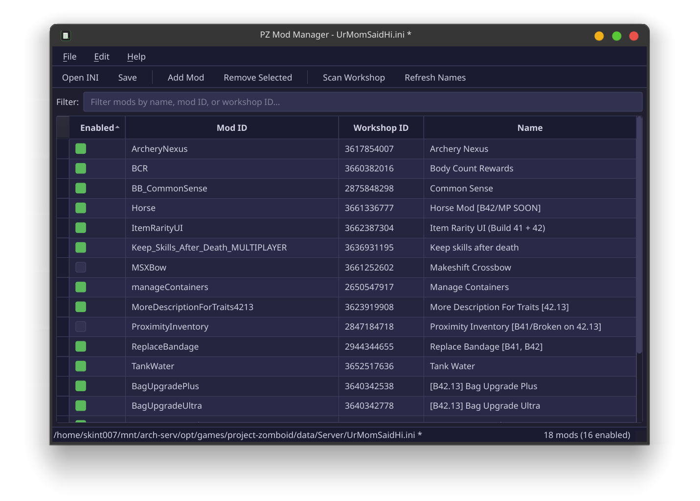

# PZ Mod Manager

A desktop application for managing Project Zomboid server mod lists. Instead of manually editing semicolon-separated `Mods=` and `WorkshopItems=` lines in server INI files, use this GUI to add, remove, reorder, and enable/disable mods.


-green)


## Features

- **Load/save** Project Zomboid `servertest.ini` files (B42+ format supported)
- **Auto-open** last INI on launch, with Close INI to unload
- **Steam Workshop integration** — fetch mod names from the Steam API
- **Workshop scanner** — scan local workshop content to auto-resolve Mod ID / Workshop ID pairings
- **Enable/disable** individual mods with checkboxes (disabled mods persist in a sidecar JSON file)
- **Search/filter** across all columns
- **Drag & reorder** mods (load order matters in PZ)
- **Add mods** by pasting a Steam Workshop URL or ID
- **Server Settings editor** — edit all INI settings with a searchable card-based UI (booleans as checkboxes, numbers as spinboxes, etc.)
- **Copy for Docker** — copy mod IDs or workshop IDs with proper escaping for Docker env vars



## Installation

### Arch Linux (AUR)

```bash
yay -S pz-mod-manager
```

Or manually:

```bash
git clone https://aur.archlinux.org/pz-mod-manager.git
cd pz-mod-manager
makepkg -si
```

### Pre-built binaries

Download the latest release from the [Releases](../../releases) page. Available for Windows and Linux — no Python installation required.

### From source

```bash
git clone https://github.com/skint007/project-zomboid-modid.git
cd project-zomboid-modid
python -m venv .venv
source .venv/bin/activate  # or .venv\Scripts\activate on Windows
pip install -e .
pz-mod-manager
```

## Usage

1. **File > Open** — select your server's `.ini` file (e.g. `servertest.ini`)
2. **Edit > App Settings** — set your Steam Workshop content path and API key ([get one here](https://steamcommunity.com/dev/apikey))
3. Add/remove/reorder mods, toggle checkboxes to enable/disable
4. **Edit > Server Settings** — edit all server INI options in a searchable dialog
5. **File > Save** — writes changes back to the INI

## Building from source

```bash
pip install -e ".[build]"

# PyInstaller (single executable)
pyinstaller pz_mod_manager.spec

# Nuitka (compiled binary)
bash scripts/build_nuitka.sh        # Linux
scripts\build_nuitka.bat             # Windows
```

Output goes to `dist/`.

## Running tests

```bash
pip install -e ".[dev]"
pytest
```
